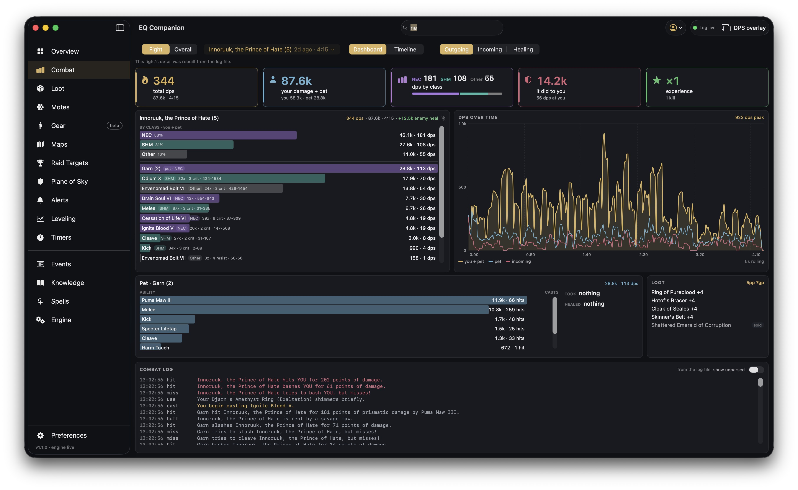

# Combat

Every fight you have had, one mob at a time: how hard you hit and with what, what hit you, your
pet, what the kill paid, and the log lines behind it.

## Choosing a fight

The row of controls across the top:

- **Fight / Overall** — a single fight, or the zone session's totals.
- **The fight picker** — opens every fight the log holds, by day. Choose **Last 24h** (the
  default), **3d**, **7d** or **30d**, and type to filter by mob or zone: it matches anywhere in the
  name, ignores case, and takes `*` as a wildcard (`gloom` finds every gloomwater mob). The top row
  is always the current fight while one is open, and the last fight between pulls.
- **Dashboard / Timeline** — the dashboard below, or every event of the fight in order.
- **Outgoing / Incoming / Healing** — which way the damage (or healing) went.

**A pull of several mobs is shown one mob at a time.** In the picker each mob of a pull is its own
row ("1 of 3 in pull"); on the live or last fight a strip of chips above the dashboard switches
between them.

**Older fights** are rebuilt from the log file when you open them — the note under the header says
so — so a fight from last week has the same detail as the one you just finished.

## The numbers

| Card | What it shows |
| --- | --- |
| **total dps** | Damage per second over the fight, its total and length, and — on the current or last fight — your combat stance, invocation and blade coats. A green dot while you are in combat. |
| **your damage + pet** | Yours and your pet's, and the split between you. |
| **dps by class** | EverQuest Legends runs up to three classes at once; this is how much of your dps each one did. |
| **it did to you** | The damage this mob landed on you, and its dps. |
| **experience** | What the kill gave (the percent, when the log states it), the kills, and any AA points. |

## The meter

**Outgoing** opens straight on your breakdown: your damage by class, then every ability — spell,
melee skill, proc — with its damage and its own dps, coloured and tagged by the class it belongs
to. Your pet is one row of it.

How an ability finds its class: a spell goes to the one class of your loadout that can cast it;
melee (Melee, Kick, Cleave…) to your most melee class; your pet to the class that has pets. A spell
two of your classes share goes to the one that gets it at the lower level. An item click or a proc
with no spell behind it is **Other**.

**Incoming** lists everything that hit you, each with the abilities it used, then how many swings
you avoided and how. **Healing** lists each healer with the spells they healed with.

The copy button copies the breakdown on screen as text.

## DPS over time

Your damage (with your pet and anyone fighting beside you), the pet's own line, and what came in,
on a five-second rolling window.

## Procs, pet, loot

- **Procs** — what procced in the fight and how often (per minute), when anything did.
- **Pet** — your pet's abilities with their damage and hits, beside the spells it cast and how many
  were resisted; the damage it took (from this mob), the heals it got, and the buffs on it. A pet
  the game never names as yours is recognised when you heal it and it fights.
- **Loot** — what came off this mob's corpse, sold items marked, and the coin. Click an item for its
  card.

## Combat log

The fight's own lines. For a fight from before this launch they are read back from the log file.
**Show unparsed** adds the lines the parser did not recognise.

## The DPS overlay

**DPS overlay** in the toolbar opens a floating meter that stays above the game. Its preferences —
whose damage it shows (you, your group, or everyone) and whether your pet rides inside your bar —
are under **Preferences → Combat**.
