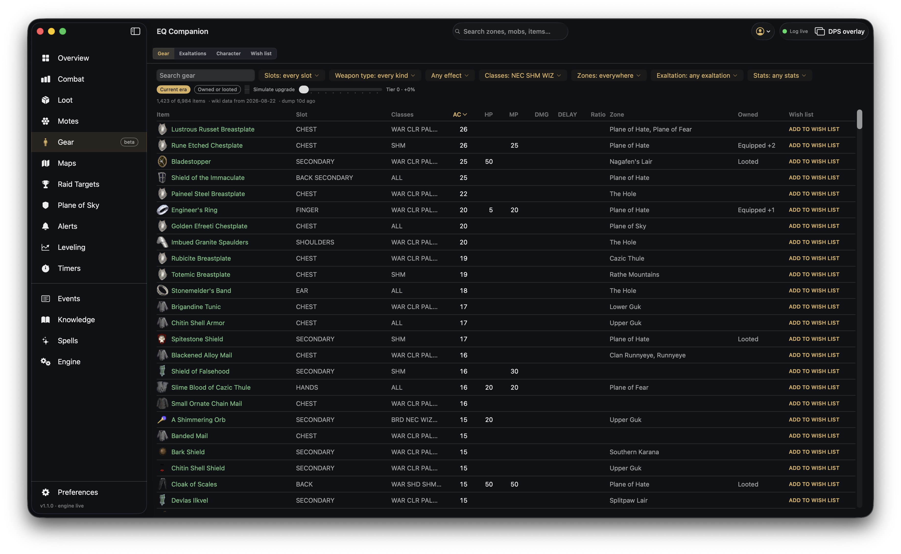

# Gear

Gear planning from the wiki's item data and your own inventory. The tab is in **beta**.

Four views, from the switch at the top:

## Gear

Every item the app knows, filterable and sortable:

- **Search gear**, then narrow by **slot**, **weapon type**, **effect**, **classes** (your loadout by
  default), **zones**, **exaltation** and **stats**.
- **Current era** keeps to items from content that is out now; **Owned or looted** keeps to what
  your newest inventory dump names or your loot history saw.
- **Simulate upgrade** shows every item's stats at a higher `+N` tier, the way the in-game item
  window scales them.

The **Owned** column says where you have an item — equipped (with its tier), in your bags, or looted
— from your newest `/outputfile inventory` dump plus your loot history. The line above the table
says how old that dump is; run `/outputfile inventory` in game again after you change gear.

Click an item for its card: the upgrade slider, the full stats, what it does for you, which quests
use it and who drops it. The same card opens from the Loot tab, a mob on the map, the toolbar
search and the Combat tab's loot. **Add to wish list** puts it on your list.

## Exaltations

Every effect that can be read off an item page, grouped by effect, with the items that carry it —
for planning which items to extract an effect from. Each row says what extracting it costs (focus
at +1, click at +2, worn at +3, proc at +4).

## Character

A character sheet from your newest inventory dump and the log: who you are, your class loadout,
what you are wearing slot by slot, what that gear adds up to, and the rest of your bags. Your real
AC, HP, mana and resists are not in any dump the game writes, so they are not here.

## Wish list

What you are still trying to get, grouped by where it drops, with what you already own crossed off
— a route for your next session.
