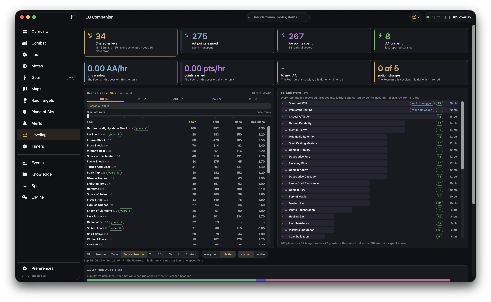

# Leveling

Your level and alternate-advancement progress, how fast you are earning them, and which spells and
AA abilities you have.

## Across the top

- **Character level** — the level the log last stated, and when; how many level-ups the log holds,
  your peak, and any class swaps.
- **AA points earned / spent / unspent** — earned is spent plus unspent; spent counts the ranks
  you have allocated; unspent is the last balance the game reported.

Under them, your pace **for the time range chosen at the bottom**: AA per hour, points per hour,
the time to your next AA, and potion charges. Each card names its window. *Inferred* marks a number
the log implies rather than states.

## Best at

The best spells for your classes at a level, ranked. Choose the level with the arrows beside it and
the kind with the tabs — **DD** (direct damage), **DoT**, **AOE**, **Heal**, **HoT** — and sort by
any column (dps, damage, mana, damage per mana). Spells you have are marked with the rank you have
(*yours: IV*); **Simulate rank** shows every spell at a higher rank. **Search all spells** looks
beyond your classes and level.

## AA abilities

Every AA rank the log recorded, grouped into ladders and sorted by points invested. Click a row for
its rungs. A rank marked *unlogged* never appears in this log — bought before you turned logging on
— and *auto* marks ranks the game granted rather than you bought.

## The time range

The bar under the panels sets the window for the pace cards and the charts: **All**, this
**Session**, this **Zone**, **Zone + Session**, the last **7d / 24h / 6h / 1h**, or a **Custom**
range. For the zone ranges, **every tier / this tier** counts every difficulty tier of the zone or
only the one you are in; **elapsed / active** measures rates per hour online or per hour actually fighting.

## Charts

**AA gained over time** and **level over time**, across the width of the window, tinted by zone —
the level line follows the percentages the game stated between dings.
