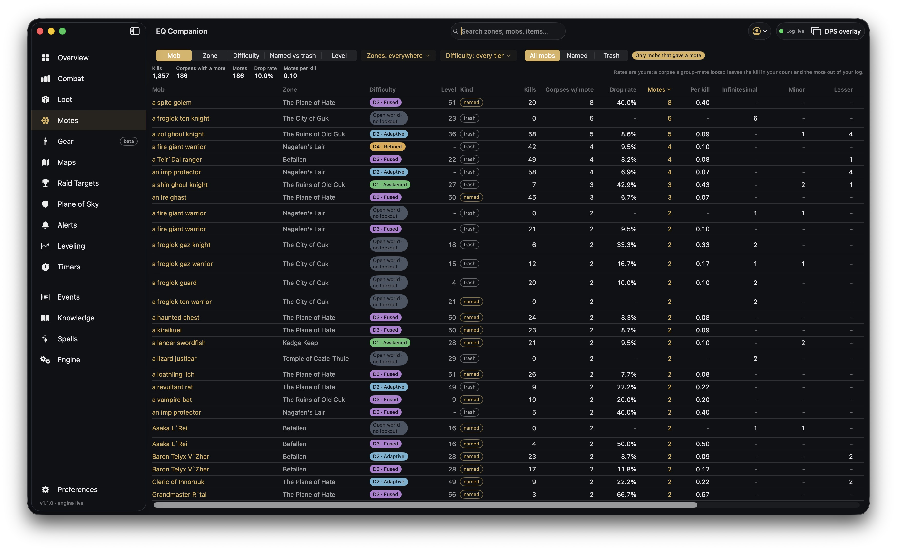

# Motes

Where your motes come from: every mob you have killed, how many of its corpses gave a mote, and
which motes they were — so you can see which camps are worth your time.

## Grouping and filters

- **Mob / Zone / Difficulty / Named vs trash / Level** — the same numbers at a coarser grain. A
  group's drop rate is its corpses with a mote over its kills, never an average of the rows inside
  it.
- **Zones** and **Difficulty** — narrow to some zones, or some dungeon tiers (Open world, D0 base,
  D1 Awakened, D2 Adaptive, D3 Fused, D4 Refined).
- **All mobs / Named / Trash** — named mobs only, trash only, or both.
- **Only mobs that gave a mote** — on by default. Off, every mob you have killed is a row, and a
  zero is a fact about that mob.

## The numbers

The line under the filters sums the table as filtered: kills, corpses with a mote, motes, the drop
rate and motes per kill.

| Column | Meaning |
| --- | --- |
| **Zone, Difficulty, Level, Kind** | Where it lives, the dungeon tier you killed it in, its level, named or trash. The same mob in two tiers is two rows. |
| **Kills** | Your kills of it. |
| **Corpses w/ mote** | How many of those corpses gave you a mote. |
| **Drop rate** | Corpses with a mote over kills. |
| **Motes, Per kill** | Motes looted, and motes per kill. |
| **Infinitesimal … Greater** | How many of each mote grade. |

Click a column header to sort by it.

**The rates are yours.** A corpse a group-mate looted still counts as your kill, but its mote is not
in your log — in a group the rates read low.
