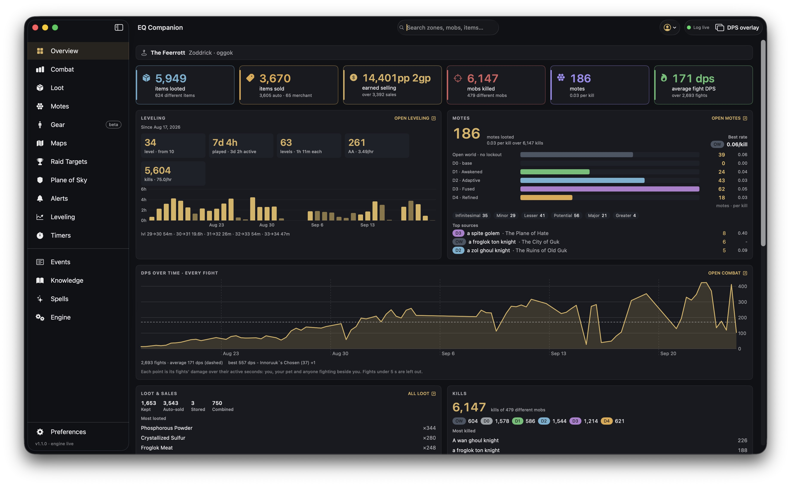

# Overview

The landing tab: a sheet of statistics about **all of your play** on the selected character — every
card covers the whole log, not the current session. Each card links (top right) to the tab that
holds the detail.

## Across the top

The zone you are in, and the character and server the app is reading.

Then six headline numbers:

| Card | What it counts |
| --- | --- |
| **items looted** | Every item that came off a corpse or chest, stacks counted; the caption says how many different items. |
| **items sold** | Items sold, split between auto-sold at loot and sold to a merchant. |
| **earned selling** | The money those sales made, and how many sales. Hover for the auto / merchant split. |
| **mobs killed** | Your kills — your own killing blows and your pet's — and how many different mobs. |
| **motes** | Motes looted, and motes per kill. |
| **average fight DPS** | Damage over active seconds, averaged across every fight. |

## Leveling

Your whole playtime, since the first line the log holds:

- **level** — where you are now, and the level the log first saw you at.
- **played** — time online, and how much of it was *active* (a kill, experience or loot at most five
  minutes after the last one; the rest is idle).
- **levels** — level-ups, and the average active time each one took.
- **AA** — ability points earned, per active hour.
- **kills** — per active hour.

The bars are your active hours on each day you played — brighter on a day you gained a level. The
line under them is how long your last few level-ups took. A class swap's level reset is not counted
as a level-up.

## Motes

Every mote you have looted: the total and rate per kill, the best rate by dungeon difficulty, a bar
per difficulty tier (Open world, D0 base through D4 Refined) with its mote count and per-kill rate,
the count of each mote grade (Infinitesimal through Greater), and the mobs that have given you the
most. See [Motes](motes.md) for the full table.

## DPS over time · every fight

Your fights from first to last, in up to 120 evenly spaced points: each is the damage of the fights
in that stretch over their active seconds — you, your pet and anyone fighting beside you. The dashed line is your average; fights under five seconds are left
out. Under it, your best fight.

## Loot & sales, Kills

What you kept, auto-sold, stored and combined, and your most-looted items with their counts. Kills
by difficulty tier, and the mobs you have killed most.

## Recent drops, Recent kills

The newest items you looted and mobs you killed, with the zone and whether the kill gave
experience.
